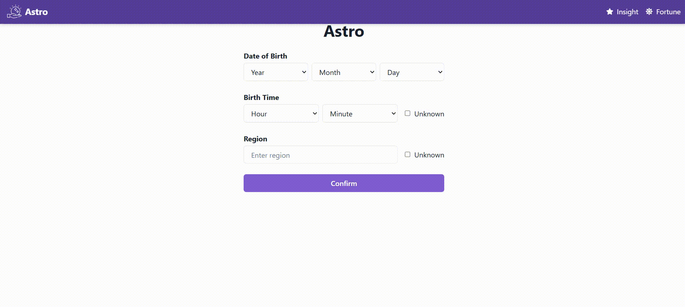

# 🪐 Astrology AI Insight Generator (Internship Project)

### **A Full-Stack Application for Dynamic AI Content Generation**



This project was conceived and built over a 2-month period during my Summer 2025 internship to demonstrate **end-to-end full-stack implementation** and the **integration of Large Language Models (LLMs)** into a user-facing web platform.

---

### 🛠️ **The Technical Stack**

| Category | Technology |
| :--- | :--- |
| **Frontend** | React, TypeScript, Chakra UI, Google Places API |
| **Backend** | Python, Flask, LLMs (OpenAI Integration) |
| **Tools & Flow** | Postman, Vercel, Git |

---

### 🚀 **Key Features and Technical Impact**

1.  **Dynamic LLM Integration:**
    * **Impact:** Designed the Python Flask backend to securely handle user birth data and successfully integrate an LLM API. Engineered a solution to ensure the LLM returned reliable, **structured content** (JSON format) for personalized readings.

2.  **Full-Stack Data Flow & UI:**
    * Implemented seamless data flow from the React frontend, utilizing the **Google Places API** for accurate location handling, through to the Flask API.
    * Delivered a clean, responsive UI where results are dynamically rendered based on the AI's response.

---

## **🌐 Deployment & Setup (Local Execution Guide)**

This section provides a clear, step-by-step guide for launching both the backend and frontend of the application locally.

### **I. Prerequisites**

You must obtain and configure the following before running the application:

* **OpenAI API Key:** Required in the backend for LLM functionality.
* **Google Maps API Key:** Required in the frontend for the Google Places Autocomplete feature.

### **II. Quick Start (Local Development)**

1.  **Clone the Repository:**
    ```bash
    git clone [Your Repository URL]
    ```

2.  **Backend Setup (Python Flask):**
    * Navigate to the `backend/` directory:
        ```bash
        cd backend
        ```
    * Install dependencies:
        ```bash
        pip install -r requirements.txt
        ```
    * **Set the Environment Variable:** Create a **`.env` file** in the `backend/` folder and add your key:
        ```env
        OPENAI_API_KEY=YOUR_KEY_HERE
        ```
    * Run the server:
        ```bash
        python run.py
        ```

3.  **Frontend Setup (React):**
    * Open a **new terminal window** and navigate to the `frontend/` directory:
        ```bash
        cd frontend
        ```
    * Install dependencies:
        ```bash
        npm install 
        # or yarn
        ```
    * **Configure Google Maps API Key:** Insert your key into the required file (e.g., typically a configuration file or the public `index.html`).
    * Run the client:
        ```bash
        npm run dev
        ```

> 💡 **Note:** Ensure both terminal windows remain open, as the backend and frontend must run concurrently to enable full application functionality.
